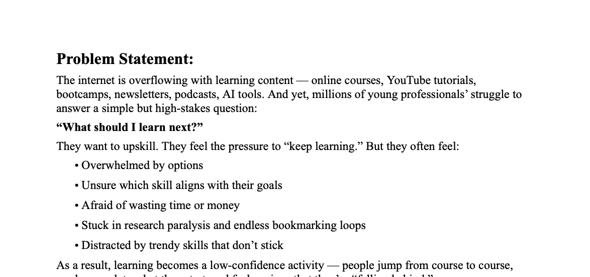
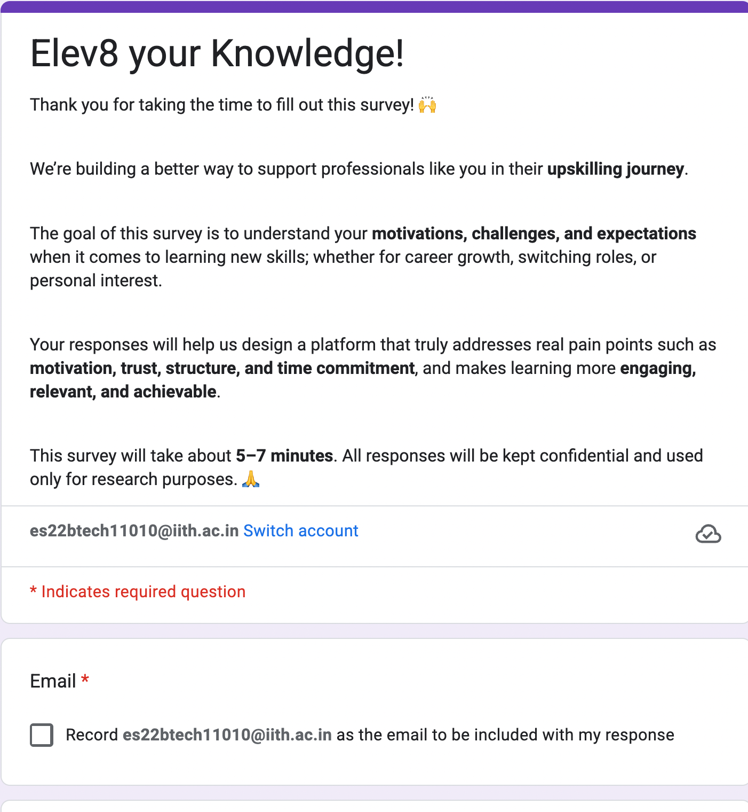
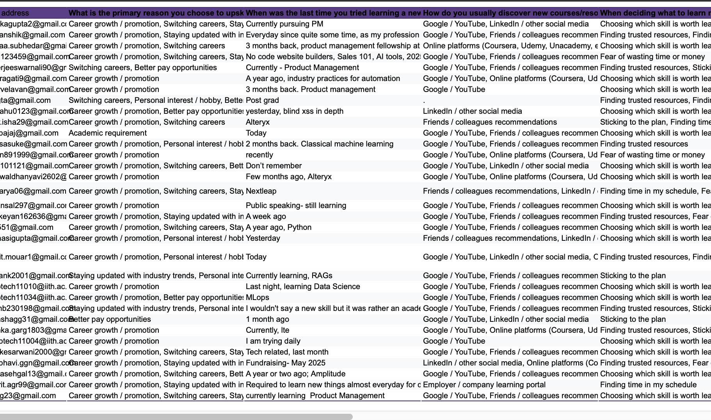
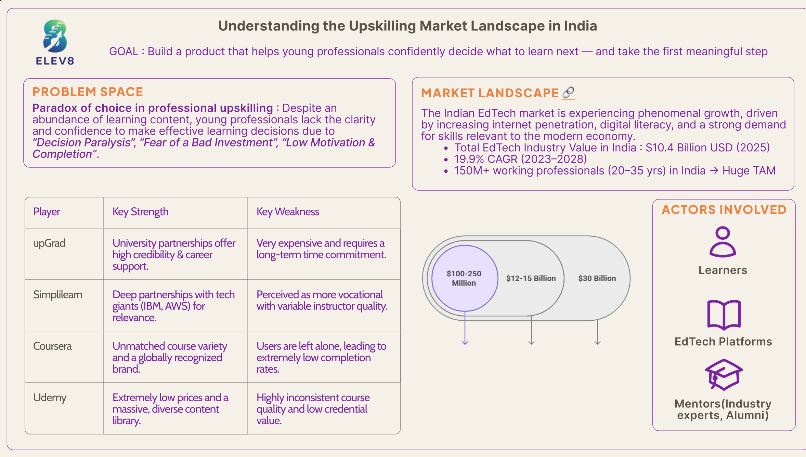

# Elev8 – Helping Professionals Decide *What to Learn Next*

---

## 1. Problem Statement  
Young professionals are overwhelmed by endless online learning options and struggle to answer a simple but high-stakes question:  
**“What should I learn next?”**

  

👉 [Read Full Problem Statement](./Problem_Statement.docx)

---

## 2. Market Assessment  
- Conducted a **Google Form survey** with early-career professionals.  
- [Google Form (live link)](https://docs.google.com/forms/d/e/1FAIpQLSfh0pnseQ7TPNVCm63-X1BYcYTCT5ml1yFejrHv8BQSIEN4-A/viewform)  
- [Survey Responses (Excel)](./Elev8%20Survey%20(Responses).xlsx)  

  
   

**Key insights from user survey:**  
- Overchoice creates confusion  
- Lack of career-linked roadmaps  
- Low motivation & accountability  
- Fear of wasting time/money  

---

## 3. Competitor Analysis  
Studied major EdTech players:  
- **Coursera** – great variety, but extremely low completion rates  
- **Udemy** – cheap, wide content, but low credibility  
- **upGrad** – strong university tie-ups, but expensive and time-heavy  
- **Simplilearn** – strong industry partnerships, but inconsistent quality  

None addresses the *confidence gap* in choosing the right next skill.  

---

## 4. Market Insights & True Problem  
- **Market size**: $10.4B EdTech industry in India by 2025, 19.9% CAGR  
- **True Problem**: Not lack of content, but **loss of confidence** in directing career growth.  
- Early-career professionals (25–34 yrs, 2–7 yrs experience) feel:  
  - Paralysed by options  
  - Fearful of wasting time/money  
  - Unsure of ROI on learning investments  

---

## 5. Defining MVP & Features (USP)  
**MVP Goal:** Provide a **clear, personalized, validated roadmap** that eliminates decision paralysis and builds trust.  

- **Must-Haves:**  
  - Personalised Skill Roadmap  
  - Curated Micro-Plan  
  - Expert & Peer Validation  
- **Should-Haves:**  
  - Progress Tracker  
  - Success Story Sharing  
- **Could-Haves (future):**  
  - Gamification  
  - Live Community  

---

## 6. User Flow & Wireframes  

1. User sets career goal (next 6–12 months).  
2. System generates a validated roadmap.  
3. User takes first micro-action → motivation via small wins.  

  
  
  

---

## 7. Architecture & Data Flow  

- **Data Flow:** Goal input → AI/curated roadmap → Micro-task plan → Progress tracking  
- Human-in-the-loop validation for early roadmaps ensures **trust + accuracy**  
- Modular design to scale from a few roles (e.g., Product Management, Data Science) → broader adoption  

  
  

---

## 8. Metrics & Monetisation  
**Metrics:**  
- North Star: Weekly Active Learners  
- Leading: Activation Rate, Week 1 Task Completion  
- Lagging: 30-Day Retention, Conversion to Premium  

**Monetisation Model:**  
- **Freemium Subscription** (₹499/mo premium for unlimited roadmaps, advanced features)  
- **B2B Upskilling Partnerships** (companies, universities)  
- **Affiliate Marketplace** (courses, career services)  

---

## 9. GTM Strategy & Mitigation  
**Go-to-Market Strategy:**  
- Product-Led Growth via free roadmap generator  
- Content-led SEO & LinkedIn carousels  
- Community engagement in Slack/Reddit/Discord  

**Risk Mitigation:**  
- Users see roadmap but don’t start → make 1st task *very easy*  
- Roadmaps not trusted → initial human validation  
- Drop-offs post one skill → proactive nudges for “next step”  
- Competitor clones → double down on **community + peer success stories**  

---

## Final Deck  

  

👉 [View Full Deck (PDF)](./Product%20Elev8.pdf)

---
